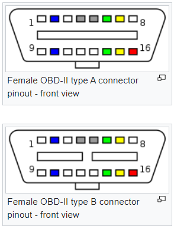
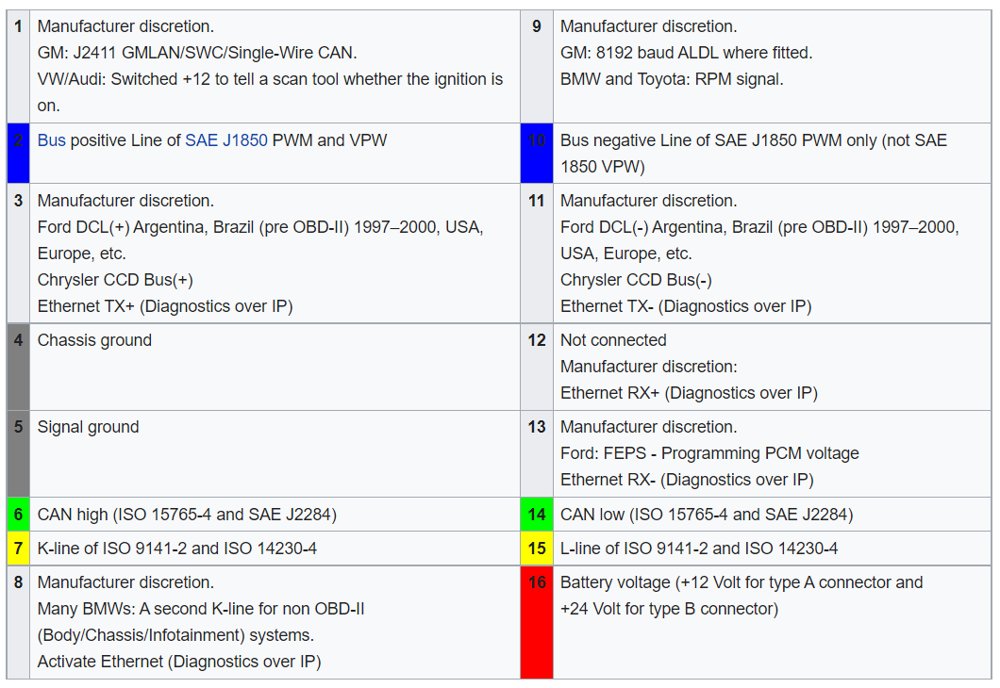
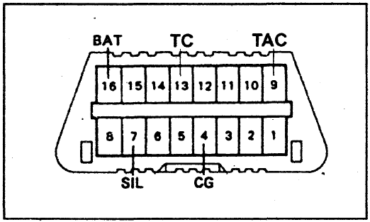

# Research

## On-Board Diagnostics (OBD)

[https://en.wikipedia.org/wiki/On-board_diagnostics](https://en.wikipedia.org/wiki/On-board_diagnostics)

OBD-II came in two models: `OBD-II A` and `OBD-II B`.

OBD-II `Diagnostic Trouble Codes` (DTCs) contain 1 letter and 4 numbers, and are divided into the following categories:
* `B` – Body (includes air conditioning and airbag) (1164 codes)
* `C` – Chassis (includes ABS) (486 codes)
* `P` – Powertrain (engine and transmission) (1688 codes)
* `U` – Network (wiring bus) (299 codes)

[https://en.wikipedia.org/wiki/Data_link_connector_(automotive)](https://en.wikipedia.org/wiki/Data_link_connector_(automotive))

Most manufacturers have made the OBD-II `Data Link Connector` (DLC) the only one in the vehicle through which all systems are diagnosed and programmed.
The `SAE J1962 specification` provides for two standardized hardware interfaces, called `type A` and `type B`.

The OBD-II specification provides for a standardized hardware interface — the female 16-pin (2x8) `J1962 connector`, 
where `type A is used for 12 Volt` vehicles and `type B for 24 Volt` vehicles. 

`JOBD` is a version of OBD-II for vehicles sold in Japan.

The `European on-board diagnostics` (EOBD) regulations are the European equivalent of OBD-II.
The technical implementation of EOBD is essentially the same as OBD-II, 
with the same SAE J1962 diagnostic link connector and signal protocols being used.

Each of the `EOBD fault codes` consists of five characters: a letter, followed by four numbers. 
The letter refers to the system being interrogated e.g. `Pxxxx` would refer to the powertrain system. 
The next character would be a 0 if complies to the EOBD standard. So it should look like P0xxx.

There are `five signaling protocols` that are permitted with the OBD-II interface. 
Most vehicles implement only one of the protocols. 
All OBD-II pinouts use the same connector, but different pins are used with the exception of pin 4 (battery ground) and pin 16 (battery positive).

It is often possible to deduce the protocol used based on which pins are present on the J1962 connector:
* SAE J1850 PWM (pulse-width modulation — 41.6 kB/sec, standard of the Ford Motor Company)
* SAE J1850 VPW (variable pulse width — 10.4/41.6 kB/sec, standard of General Motors)
* ISO 9141-2. This protocol has an asynchronous serial data rate of 10.4 kbit/s. It is somewhat similar to RS-232. Primarily used in Chrysler, European, and Asian vehicles.
* ISO 14230 KWP2000 (Keyword Protocol 2000)
* ISO 15765 CAN (250 kbit/s or 500 kbit/s). The CAN protocol was developed by Bosch for automotive and industrial control.

OBD-II provides access to data from the engine control unit (ECU) and offers a valuable source of information when troubleshooting problems inside a vehicle.
Manufacturers are not required to implement all PIDs listed in J1979 and they are allowed to include proprietary PIDs that are not listed.
The various parameters that are available are addressed by "parameter identification numbers" or `PIDs` which are defined in J1979:

[https://en.wikipedia.org/wiki/OBD-II_PIDs](https://en.wikipedia.org/wiki/OBD-II_PIDs)

There are 10 diagnostic `services` described in the latest OBD-II standard SAE J1979. 
Before 2002, J1979 referred to these services as `modes`:
* 01 - Show current data
* 02 - Show freeze frame data
* 03 - Show stored Diagnostic Trouble Codes
* 04 - Clear Diagnostic Trouble Codes and stored values
* 05 - Test results, oxygen sensor monitoring (non CAN only)
* 06 - Test results, other component/system monitoring (Test results, oxygen sensor monitoring for CAN only)
* 07 - Show pending Diagnostic Trouble Codes (detected during current or last driving cycle)
* 08 - Control operation of on-board component/system
* 09 - Request vehicle information
* 0A - Permanent Diagnostic Trouble Codes (DTCs) (Cleared DTCs)

The `ELM327` is a programmed microcontroller produced for translating the on-board diagnostics (OBD) interface found in most modern cars. 
The ELM327 command protocol is one of the most popular `PC-to-OBD` interface standards and is also implemented by other vendors.

[https://en.wikipedia.org/wiki/ELM327](https://en.wikipedia.org/wiki/ELM327)

[https://www.obdsol.com/solutions/obdlink-technology-stack/](https://www.obdsol.com/solutions/obdlink-technology-stack/)

---

## Toyota Celica seventh generation (T230; 1999–2006)

[https://en.wikipedia.org/wiki/Toyota_Celica](https://en.wikipedia.org/wiki/Toyota_Celica#Seventh_generation_(T230;_1999%E2%80%932006))

### Руководство автомобиля

#### Система диагностирования (стр. 84)

Диагностический разъем `DLC3` для `OBD-II` под рулем автомобиля.

Предохранитель OBD на `7.5А` в блоке предохранителей в салоне автомобиля.

Диагностические коды неисправности:
* Двигатель и система впрыска топлива (EFI): 85 стр.
* АКПП: 130 стр.
* Тормозная система и ABS: 203 стр.
* Кондиционер, отопление и вентиляция: 257 стр.
* Система безопасности SRS: 259 стр.

Электронный блок управления имеет встроенную систему самодиагностики, которая по сигналам датчиков непрерывно отслеживает состояние двигателя.
В случае обнаружения неисправности эта система идентифицирует ее и информирует об этом водителя сигналом, 
который высвечивается индикатором "СНЕСК ENGINE" ("проверьте двигатель"), расположенным на комбинации приборов.

Система самодиагностики имеет несколько режимов работы: 
* режим обычной (текущей) самодиагностики
* режим тестирования

При работе в режиме обычной самодиагностики электронный блок управления анализирует различные сигналы 
и определяет отказавшую систему по выходным параметрам, зафиксированным соответствующими датчиками или исполнительными механизмами. 
Индикатор "СНЕСК ENGINE" на комбинации приборов информирует водителя о наличии неисправности. 
Индикатор выключается автоматически сразу после устранения неисправности.
Однако электронный блок хранит в своей памяти коды неисправностей, связанных с соответствующими отказами, до тех пор, 
пока диагностическая система не очистится (не "сбросит" информацию) путем отключения предохранителя "EFI" при выключенном зажигании.
Диагностический код может быть определен по числу миганий индикатора "СНЕСК ENGINE" 
при замкнутых выводах "ТС" и "CG" ("13" и "4") диагностического разъема DLCЗ (однако не все коды высвечиваются на приборной панели). 
При наличии двух и более неисправностей их индикация начинается с наименьшего кода (имеющего наименьший номер) и далее продолжается по возрастающей.

Режим тестирования используется при поиске неисправностей, которые трудно определить в режиме обычной самодиагностики.
Проверка в режиме тестирования производится только при помощи сканера.

Блок электронного управления предупреждает о неисправности или ненормальной работе посредством индикатора "СНЕСК ENGINE" на панели приборов. 
Неисправность идентифицируется в виде диагностического кода, который запоминается электронным блоком управления. 
Диагностический код может быть расшифрован по числу миганий световой индикации при закорачивании определенных выводов диагностического разъема.

Любой диагностический код в запоминающем устройстве электронного блока управления стирается при снятии провода с отрицательной клеммы аккумуляторной батареи. 
Поэтому перед отключением аккумуляторной батареи необходимо прочесть диагностические коды.

---
